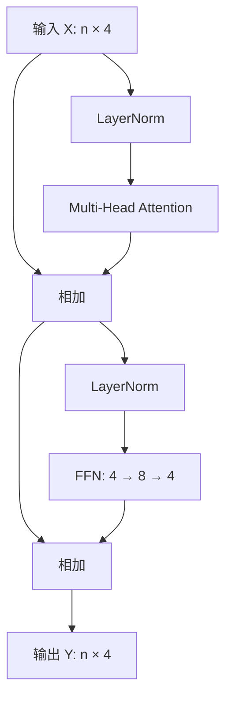

# 第四课：组装一个 Transformer Block

本课采用 Pre-LN，LayerNorm 放在子层之前：



```text
H = X + MHA(LN1(X))
Y = H + FFN(LN2(H))
```

输入输出形状相同，因此可以堆叠多个 Block。位置编码在本例进入第一个 Block 前加入，不在每个 Block 重复添加。

Post-LN 则为 `H=LN1(X+MHA(X))`、`Y=LN2(H+FFN(H))`。两者的归一化位置不同，不能把公式混写。完整模型还可能有最终归一化层。

运行 `04_transformer_block`，逐步查看输入、归一化输入、Attention 输出、第一次残差、FFN 输出和最终结果。对照 `exercises/week03/torch_block_example.py`：其输入增加 batch 维，为 `(batch,n,4)`；注意力每头权重为 `(batch,heads,n,n)`。两个实现结构对应，但参数不同，不能直接比较数值。

本例未使用 causal mask，所有位置可互相访问。第四周再加入“不能看未来”的约束。它也未训练，因此只是结构演示。

验收：不看讲义写出两个残差公式，指出 Attention 与 FFN 各自在哪里混合信息，并解释为何整个 Block 保持形状。
