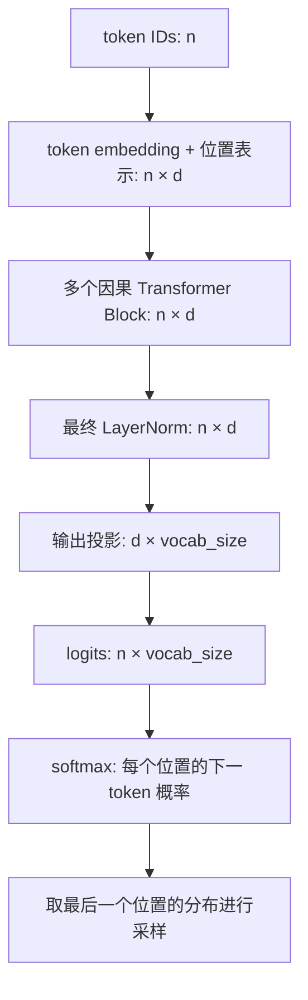

# 第一课：从 Transformer Block 到 GPT

上周的 Attention 允许每个位置读取全部 token。GPT 使用 decoder-only 架构，通过 causal mask 约束信息流：位置 i 只能读取位置 0 到 i。这里的 decoder-only 指一组因果自注意力 Block，没有 encoder-decoder cross-attention。



示例沿用 Pre-LN Block 和正弦位置编码。真实 GPT 系列的位置表示、归一化和激活函数可能不同；这里学习共同的数据流。logits 是原始分数，不是概率。

对于 `我 喜欢 学习`，3 个位置的可见范围为：

```text
            我  喜欢  学习   ← 被读取的位置（列）
我          ✓    ×    ×
喜欢        ✓    ✓    ×
学习        ✓    ✓    ✓
↑ 发起查询的位置（行）
```

对角线保留：当前位置的输入 token 已知，任务是预测它后面的 token。mask 应在 softmax 之前把未来位置的分数设为负无穷；对应权重变成 0，允许位置的权重和仍为 1。直接在 softmax 后清零会破坏归一化，除非再次归一化。

运行第一课。先预测：修改第三个 token 后，第一个位置输出会改变吗？分别比较无 mask 和有 mask 的结果。因果实验中前两个位置应保持一致，第三个可以变化。多个因果 Block 堆叠后也不会让未来信息绕过 mask。

维度：输入 `(n,d)` → 每头 Q/K/V `(n,d_head)` → 权重 `(n,n)` → 拼接 `(n,d)` → Block `(n,d)` → logits `(n,V)`。`V` 在此指词表大小，与 Attention 的 Value 矩阵区分。

验收：画一个 4×4 可见性矩阵；解释为什么对角线可见；指出最后一行能读取全部现有上下文，却仍没有访问未来。
